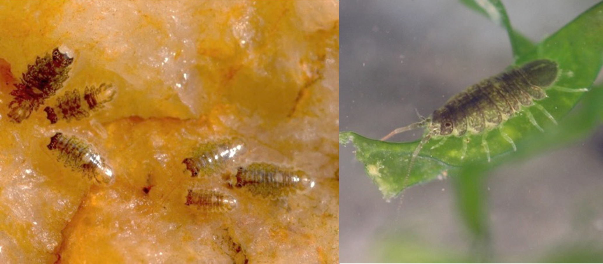

# About me
Having done a double diploma in an agronomy engineering school (L'institut Agro Montpellier) and a master orinted towards Biodiversity, Ecology and Evolution (at the University of Montpellier), I am currently a second year PhD student at the Statin Biologique de Roscoff, where I did my master's thesis.

 I am interested by speciation questions and more particularly the following questions:
  -  How do barriers to reproduction appear and become associated to form different species?
  -  How do isolation between closely-related species evolve?
  -  How do phenotypic traits involved in barriers to reproduction evolve?
  -  What is the role played by chromosomal rearrangements in the speciation process?
  -  How is the speciation process translated at the genome scale?

# 1. Master's Thesis

*Image credits: background and littorina drawings: Sean Stankowski*

From January to July 2024, I did a comparative genomic study of Littorina fabalis. This marine gastropod is found on the ficoid belt along the shore and forms hybrid zones between ecotypes that are locally adapted to wave exposure gradients (see Johannesson et al., 2025 or Le Moan et al., 2016 for definitions of ecotype). In addition, these ecotypes are differentiated by chromosomal inversions that play a role in local adaptation. We thus compared a hybrid zone in Sweden and a hybrid zone in France using whole genome data.

## Related publications:

 -  **Pajot B.**, Broquet T., Choo L. Q., Barry P., Faria R., Butlin R. K., Johannesson K., Le Moan A. (preprint). Inversions support both parallel and location-specific adaptations in snail ecotypes.
 -  Reeve J., Ghane A., Barry P., Balmori de la Puente A., Butlin R. K., Choo L. Q., Le Moan A., Garcia Castillo D., Peris Tamayo A. M., Kingston S., Leder E. H., Stankowski S., **Pajot B.** (2024). A sequencing pipeline for processing short-read sequencing data from Littorina snails V.3. [Protocols.io](https://dx.doi.org/10.17504/protocols.io.dm6gp3m21vzp/v3)

## Supervision

 -  [Alan le Moan](https://www.sb-roscoff.fr/fr/alan-le-moan)
 -  [Thomas Broquet](https://www.sb-roscoff.fr/fr/thomas-broquet)

# 2. PhD project

*Image credits: Thomas Broquet*

Since October 2024, I am working on the evolution of sexual isolation between species of the complex of marine isopods Jaera albifrons. This marine isopod complex that can be found on the shore is composed of five closely related species, four of which are found on European coasts. Each of these species has a specific mating courtship (see work of Solignac). These courtship establishes a barrier to reproduction between species of the complexe. However, it is not clear how this sexual behavioural barrier appeared and evolved in the different species. This is the central question of my PhD. To answer this question, we use experimental approaches to study mate choice and interspecfic crosses.

     

*Figure credits: Ribardière et al., 2025*

In addition, species from the complex present a strong chromosomal polymorphism with fusions and fissions of chromosomes, Robertsonnian translocations and chromosomal inversions (see Ribardière et al., 2025). However, there also is a strong chromosomal polymorphism between species of the complex. The second part of my PhD thus consists in identifying chromosomal polymorphis associated with the speciation process and understand how these chromosomal rearrangements contribute to the speciation process. To answer these questions, we use genomic data from individuals sampled in natural populations.

# Other publications
 -  Duthiel Y. J., Hamidi D., **Pajot B.** (2024). The Site/Group Extended Data Format and Tools. [Society for Molecular Ecology and Evolution](https://doi.org/10.1093/gbe/evae011).

# References:
 -  Johannesson K., Malmqvist G., Leder E., Stankowski S. (2025). Genomic insights into the origin of ecotypes. [Trends in Ecology & Evolution](https://www.sb-roscoff.fr/en/node/252/10.1016/j.tree.2025.11.011).
 -  Le Moan A., Gagnaire P.-A., Bonhomme F. (2016). Parallel genetic divergence among coastal-marine ecotype paris of European anchovy explained by differential introgression after secondary contact. [Molecular Ecology](https://www.sb-roscoff.fr/en/node/252/10.1111/mec.13627).
 -  Solignac M. (1978). [Nature, Déterminisme et Origine des Mécanismes d'Isolement dans le Complexe Jaera albifrons (Isopodes, Asellotes)](https://hal.science/tel-05380579).
 -  Ribardière A., Daguin-Thiébaut C., Coudret J., Le Corguillé G., Avia K., Houbin C., Loisel S., Gagnaire P.-A., Broquet T. (2025). Sex chromosomes and chromosomal rearrangements are key to behaviour sexual isolation in Jaera albifrons marin isopods. [BioRxiv](https://doi.org/10.1101/2025.01.08.631900).
 -  Staiger H., Bocquet C. (1956). Les chromosomes de la super-espèce Jaera marina (F.) et de quelques autres Janiridae (Isopodes Asellotes). Bull. Biol. Fr. Belg.
